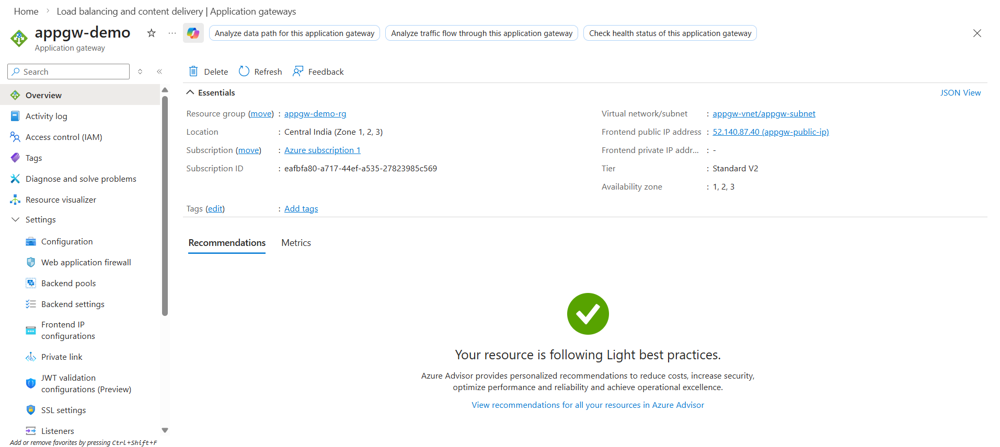
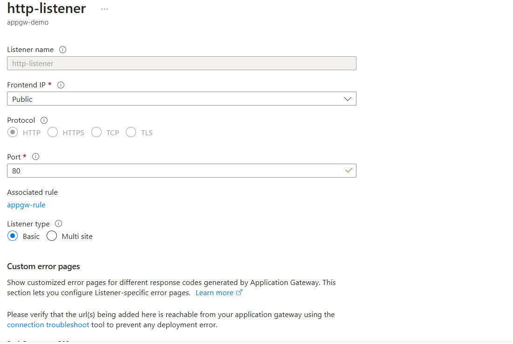
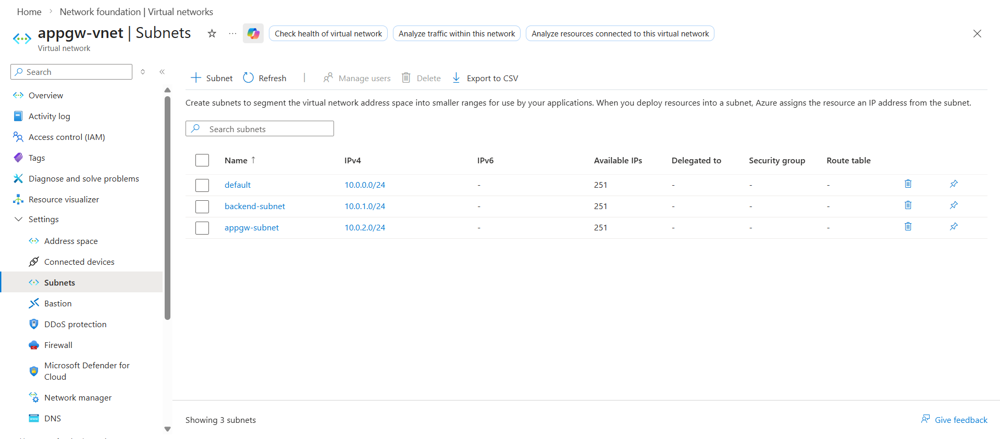
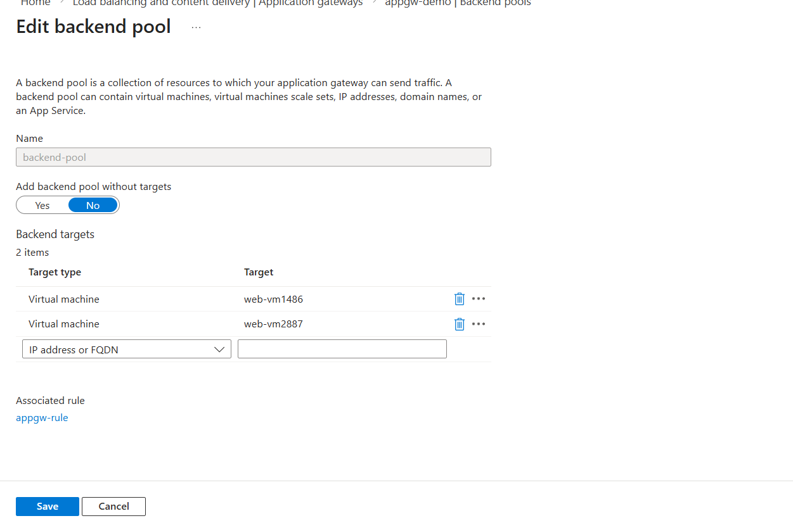
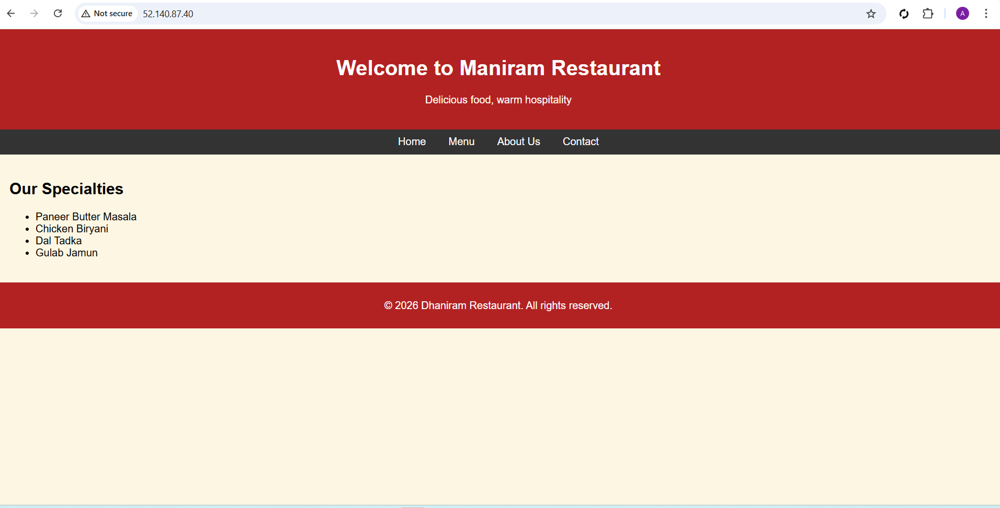
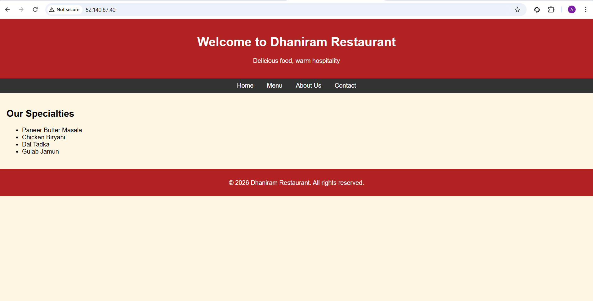
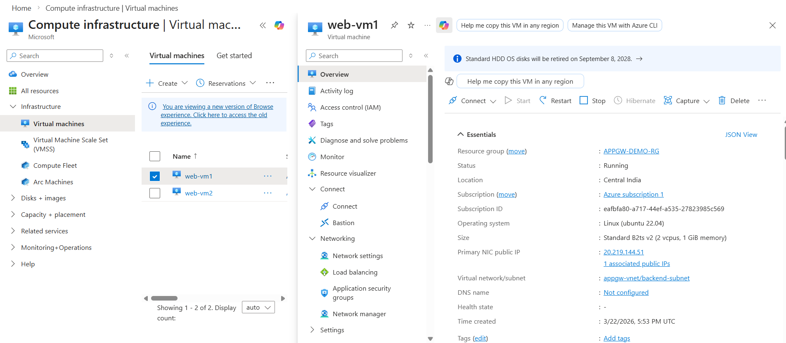
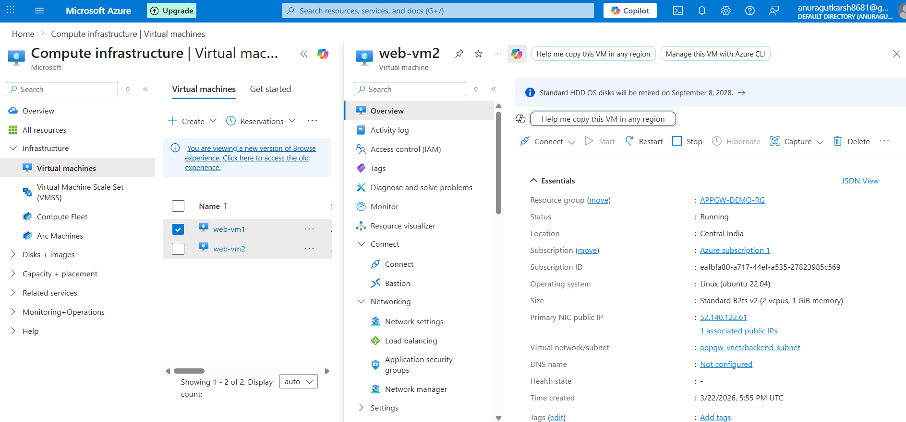

# Azure Application Gateway – Layer 7 Load Balancing Project

## Overview

This project demonstrates how to deploy and configure **Azure Application Gateway** to perform **Layer 7 (HTTP) load balancing** between two backend web servers hosted on Azure Virtual Machines.

The Application Gateway distributes incoming HTTP traffic across multiple backend servers, improving availability, scalability, and reliability.

---

## Architecture

```
Client Browser
      │
      ▼
Application Gateway (Public IP)
      │
      ▼
Backend Pool
 ┌─────────────┐
 │  Web VM 1   │
 │ Apache HTTP │
 └─────────────┘
        │
 ┌─────────────┐
 │  Web VM 2   │
 │ Apache HTTP │
 └─────────────┘
```

---

## Services Used

* Azure Virtual Network (VNet)
* Azure Subnets
* Azure Virtual Machines (Ubuntu)
* Apache Web Server
* Azure Application Gateway (Standard V2)
* Public IP Address

---

## Network Design

| Resource                   | Configuration            |
| -------------------------- | ------------------------ |
| VNet                       | appgw-vnet (10.0.0.0/16) |
| Backend Subnet             | 10.0.1.0/24              |
| Application Gateway Subnet | 10.0.2.0/24              |

---

## Virtual Machines

| VM Name | Role              | Private IP |
| ------- | ----------------- | ---------- |
| web-vm1 | Apache Web Server | 10.0.1.4   |
| web-vm2 | Apache Web Server | 10.0.1.5   |

---

## Apache Installation

```bash
sudo apt update
sudo apt install apache2 -y
```

Modify the default page:

```
/var/www/html/index.html
```

Example content:

```
Hello from WEB SERVER 1
Hello from WEB SERVER 2
```

---

## Application Gateway Configuration

### Frontend

* Public IPv4 Address
* HTTP Listener
* Port 80

### Backend Pool

* web-vm1
* web-vm2

### Backend Settings

* Protocol: HTTP
* Port: 80
* Cookie-based affinity: Disabled

### Routing Rule

* Listener: HTTP
* Backend Pool: backend-pool
* Port: 80

---

## Testing Load Balancing

Open browser and access:

```
http://52.140.87.40/
```

Refresh the page multiple times.

Expected output:

```
Hello from WEB SERVER 1
Hello from WEB SERVER 2
```

This confirms that **Application Gateway is distributing traffic between both servers**.

---

## Project Screenshots

### Application Gateway


### Application Gateway Configuration


### Application Gateway Subnets


### Backend Pool


### Load Balancer Output 1


### Load Balancer Output 2


### VM01 Configuration


### VM02 Overview



---

## Key Learnings

* Deploying Azure Application Gateway
* Layer 7 HTTP Load Balancing
* Backend Pool Configuration
* Routing Rules and Listeners
* Web traffic distribution

---

## Author

Anurag – Linux Engineer | Cloud Enthusiast
