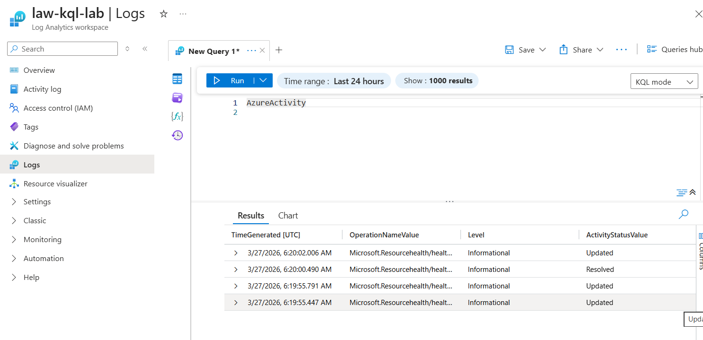
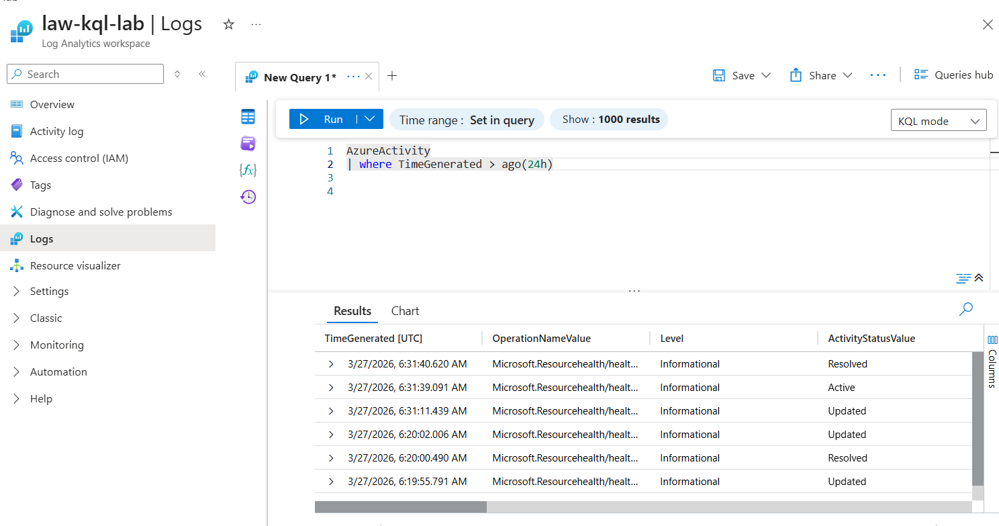
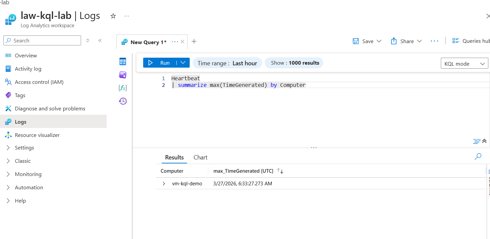

# Azure Monitoring with KQL (Log Analytics Lab)

This project demonstrates how to monitor Azure resources using **Log Analytics Workspace and KQL (Kusto Query Language)**.

## Lab Overview

In this lab we:

* Created a **Resource Group**
* Created a **Log Analytics Workspace**
* Enabled **Diagnostic settings**
* Collected logs from Azure resources
* Queried logs using **KQL**

## Architecture

Azure Resource → Diagnostic Settings → Log Analytics Workspace → KQL Queries

## KQL Queries Used

### 1. Heartbeat (VM health)

```kusto
Heartbeat
| summarize LastSeen=max(TimeGenerated) by Computer
```

### 2. Azure Activity Logs

```kusto
AzureActivity
| where TimeGenerated > ago(24h)
| project TimeGenerated, OperationNameValue, Caller
| order by TimeGenerated desc
```

### 3. Azure Diagnostics Logs

```kusto
AzureDiagnostics
| where TimeGenerated > ago(1h)
| project TimeGenerated, ResourceType, OperationName
```

## Project Screenshots

### KQL Azure Activity Query



### KQL Filter Logs



### KQL Heartbeat Query




## Learning Outcomes

* Azure Monitor basics
* Log Analytics Workspace usage
* KQL query writing
* Diagnostic settings configuration

## Tools Used

* Microsoft Azure
* Log Analytics Workspace
* KQL (Kusto Query Language)
* Azure Monitor

Author:
Anurag Utkarsh
