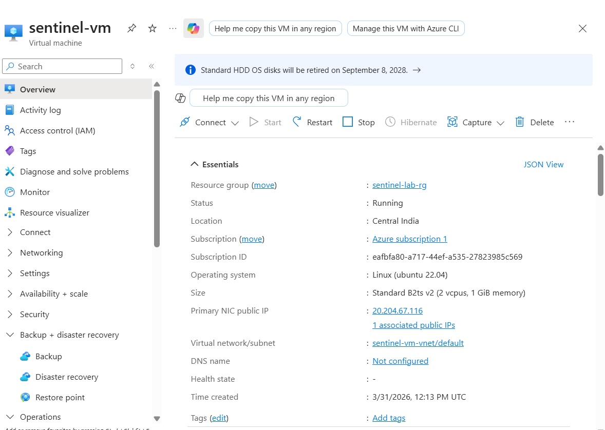
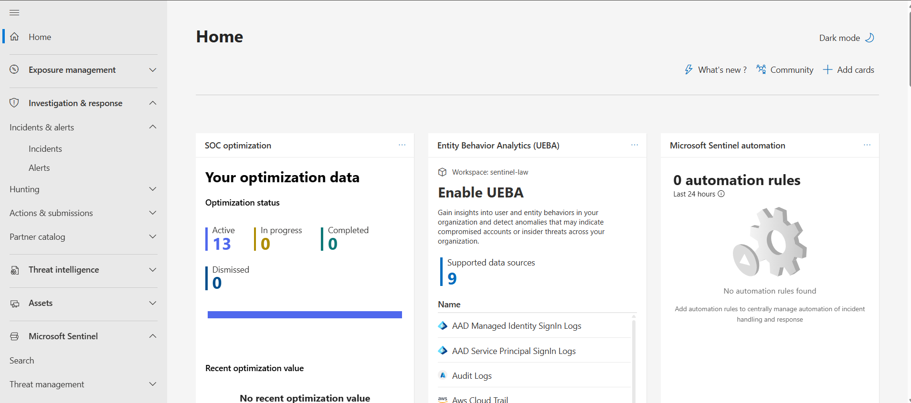
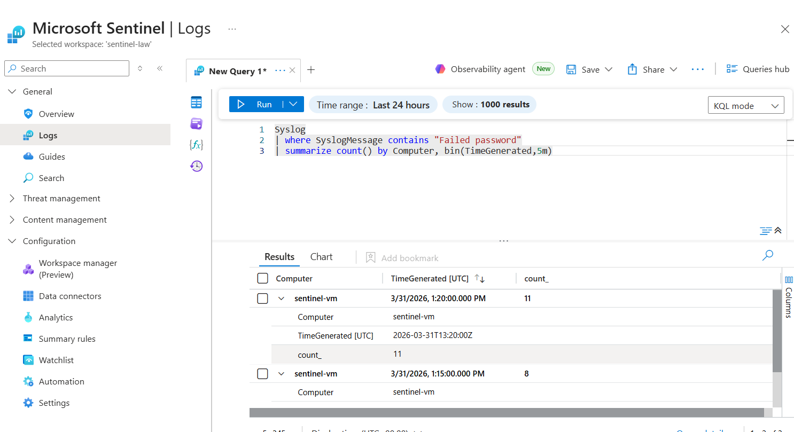
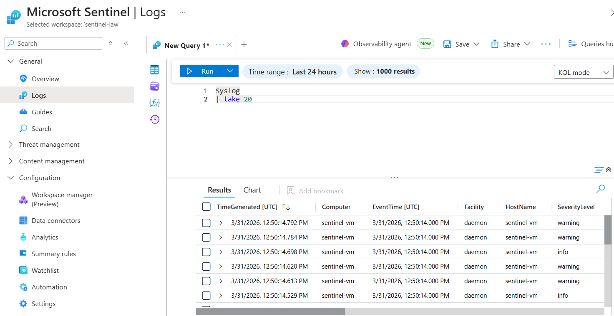
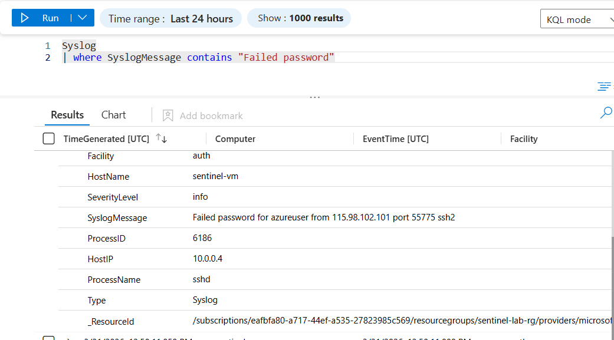
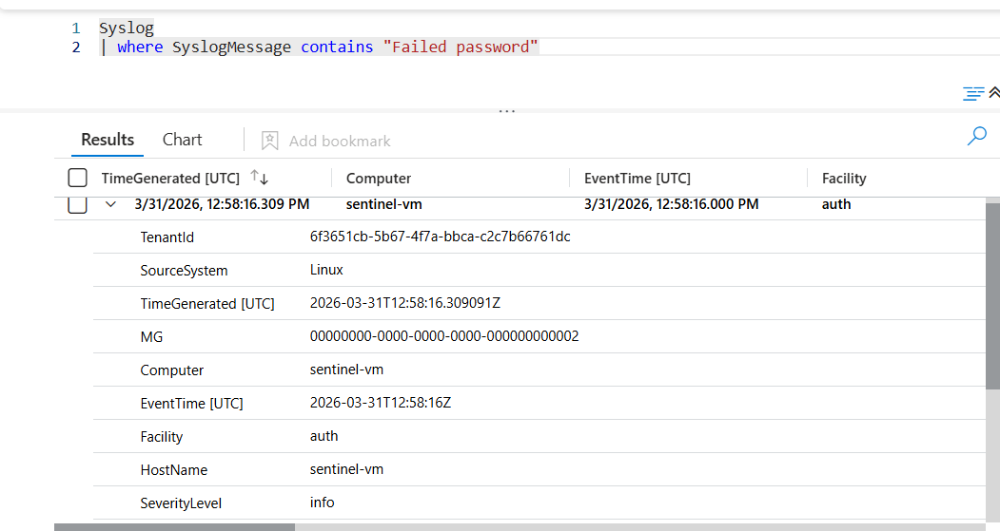
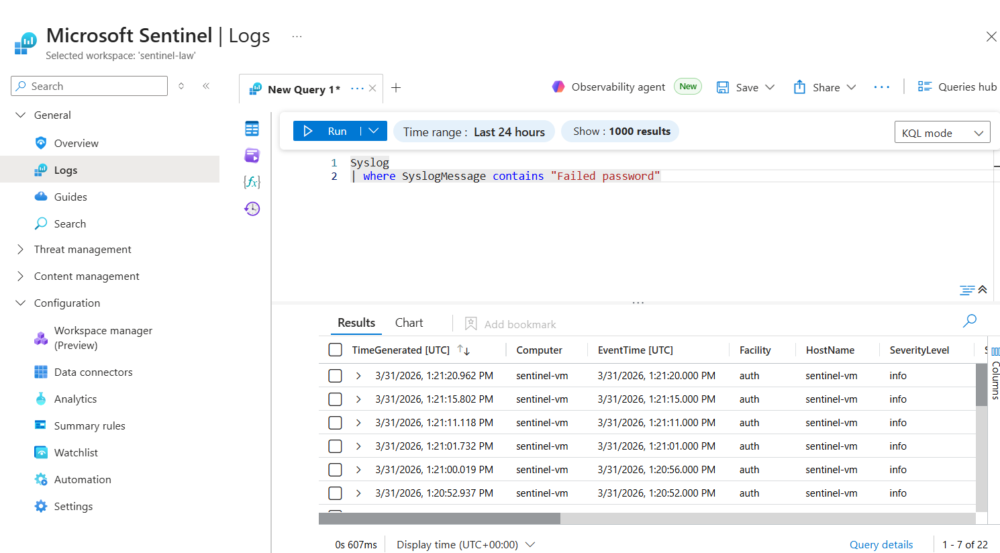
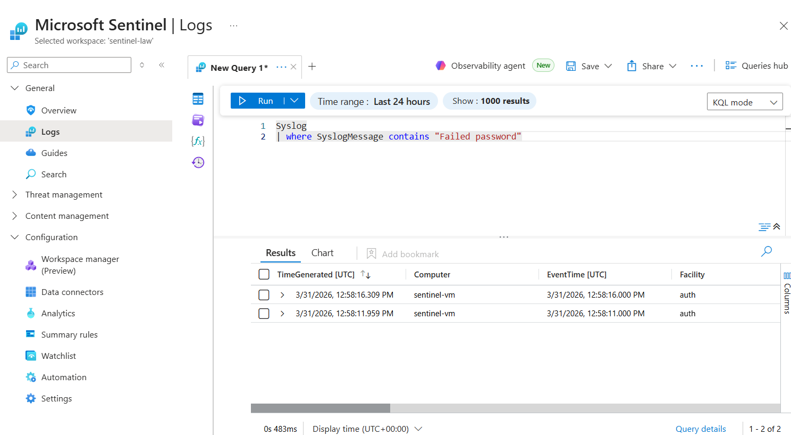
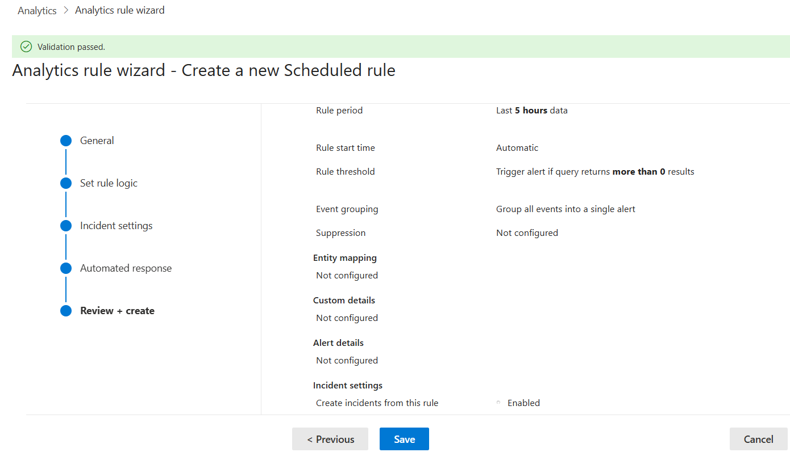

# Azure Sentinel SSH Brute Force Detection Lab

## Overview

This project demonstrates how to detect SSH brute-force attacks using Microsoft Sentinel.
Logs from a Linux virtual machine are collected using Azure Monitor Agent and analyzed using KQL queries to generate security alerts.

## Architecture

Internet Attack
↓
Azure Linux VM
↓
Azure Monitor Agent
↓
Log Analytics Workspace
↓
Microsoft Sentinel (SIEM)
↓
KQL Detection Rule
↓
Security Incident

## Technologies Used

* Azure Virtual Machine (Linux)
* Azure Monitor Agent
* Log Analytics Workspace
* Microsoft Sentinel
* Kusto Query Language (KQL)

## Detection Query

```kql
Syslog
| where SyslogMessage contains "Failed password"
| summarize count() by Computer, bin(TimeGenerated,5m)
| where count_ > 5
```

This query detects more than 5 failed SSH login attempts within 5 minutes.

## Detection Logic

If multiple SSH login failures occur in a short time window, Sentinel generates an alert and creates a security incident for investigation.

## Steps Performed

1. Created an Azure Linux Virtual Machine.
2. Enabled Microsoft Sentinel on a Log Analytics workspace.
3. Installed Azure Monitor Agent.
4. Configured Data Collection Rule (DCR) to collect Syslog events.
5. Verified log ingestion in Sentinel Logs.
6. Created a scheduled analytics rule using KQL.
7. Simulated an SSH brute-force attack.
8. Verified detection and incident generation.

## Result

Microsoft Sentinel successfully detected multiple failed SSH login attempts and generated a security alert.

## Project Screenshots

### VM Overview



### Microsoft Defender Overview



### VM Logs



### KQL Syslog Query



### Failed Login Attempt



### Failed Login Attempt 2



### Failed Password Logs



### Failed Logs Analysis



### Analytic Rule Creation




## Learning Outcome

* Hands-on experience with Microsoft Sentinel
* Understanding SIEM log ingestion
* Writing KQL detection queries
* Simulating security attacks
* Creating analytics detection rules

## Author
Anurag Utkarsh
Cloud / Linux Engineer.
