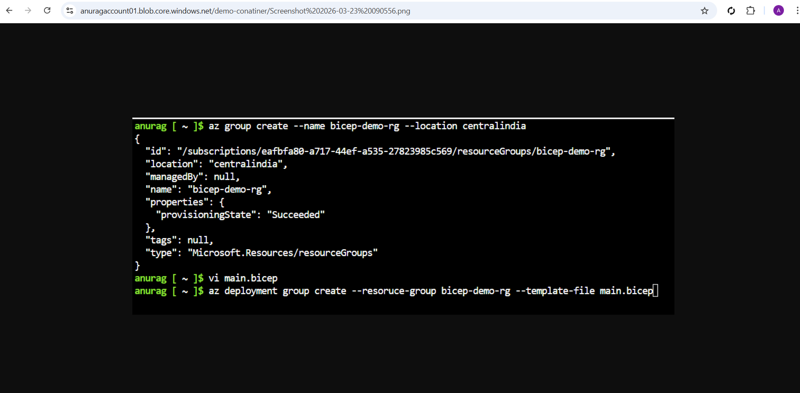
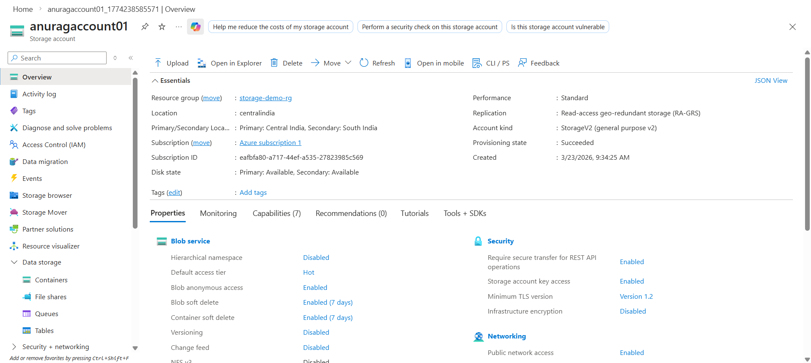
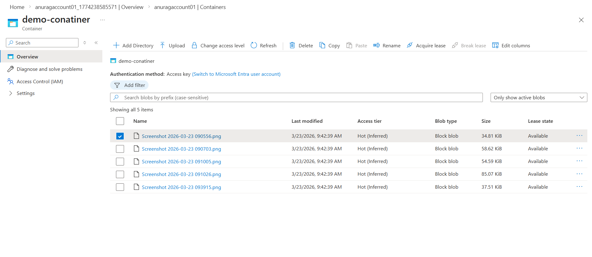
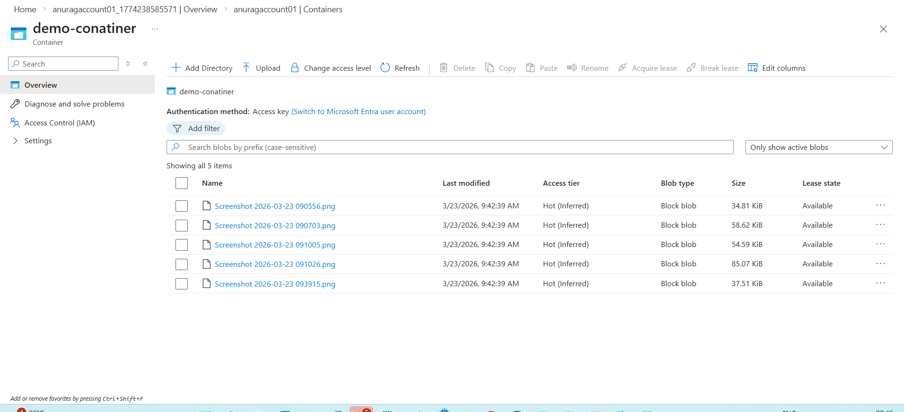

# Azure Storage Blob Project

## Project Overview

This project demonstrates how to store and access files using **Azure Blob Storage**.

Azure Blob Storage is a scalable cloud object storage solution designed for storing large amounts of unstructured data such as documents, images, backups, and logs.

In this project, a storage account was created, a blob container was configured, and a file was uploaded and accessed using a secure URL.

---

# Architecture

Client
↓
Azure Storage Account
↓
Blob Container
↓
Blob File (hello.txt)

---

# Azure Services Used

| Service               | Purpose                        |
| --------------------- | ------------------------------ |
| Azure Storage Account | Cloud storage service          |
| Blob Container        | Logical grouping of blob files |
| Blob Storage          | Store files and objects        |
| SAS Token             | Secure temporary access        |

---

# Resources Created

| Resource        | Name           |
| --------------- | -------------- |
| Resource Group  | bicep-demo-rg  |
| Storage Account | bicepstorxxxxx |
| Blob Container  | demo-container |
| Blob File       | hello.txt      |

---

# Steps Performed

## 1 Create Storage Account

A storage account was created in Azure to store blob data.

Configuration used:

* Performance: Standard
* Replication: LRS
* Region: Central India

---

## 2 Create Blob Container

Inside the storage account, a container named **demo-container** was created to store blob files.

Containers help organize blobs similar to folders.

---

## 3 Upload File to Blob Storage

A sample file **hello.txt** was uploaded to the container.

Example file content:

```
Hello from Azure Storage Blob
```

---

## 4 Generate Secure Access URL

Since the container was private, a **Shared Access Signature (SAS)** was generated to securely access the blob.

Example blob URL:

```
https://storageaccount.blob.core.windows.net/demo-container/hello.txt
```

## Project Screenshots

### Resource Group Creation



### Storage Account Overview



### Blob Storage Content



### File Upload in Blob Storage




---

# Learning Outcomes

This project demonstrates:

* Azure Storage Account configuration
* Blob container creation
* Uploading files to Azure Blob Storage
* Secure file access using SAS tokens
* Basic cloud storage architecture

---

# Author
Anurag Utkarsh

Anurag
Linux Engineer | Cloud & DevOps Learner
