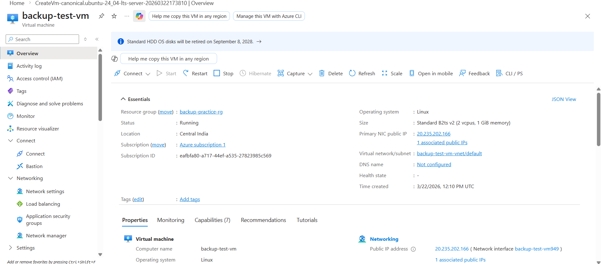
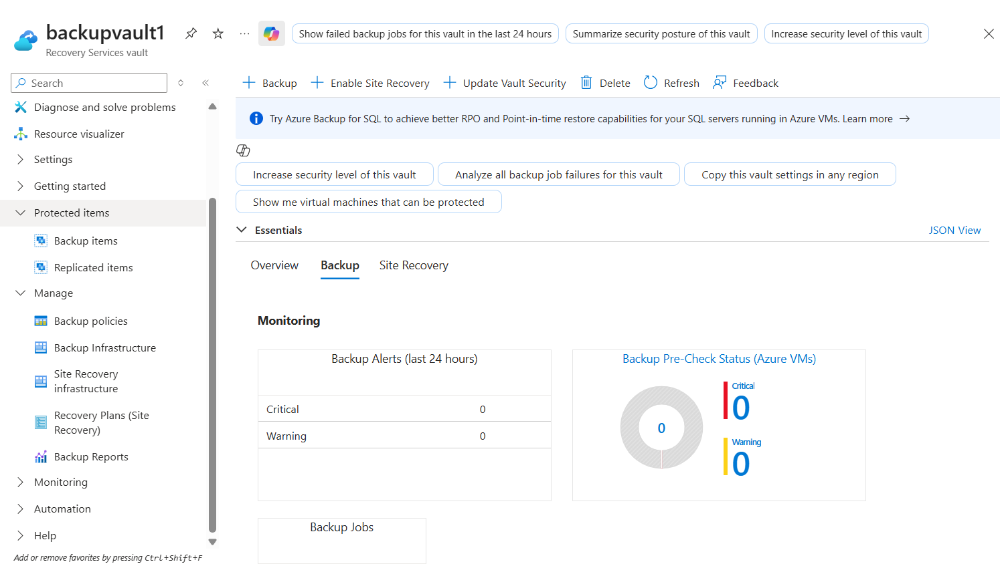
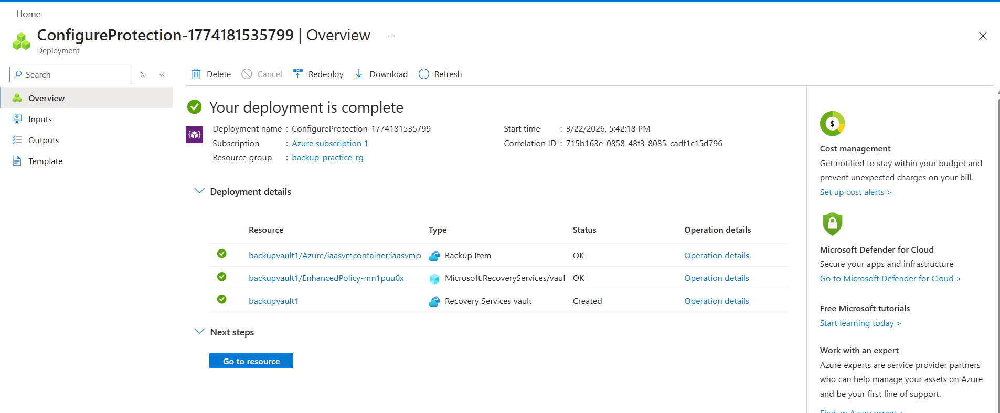
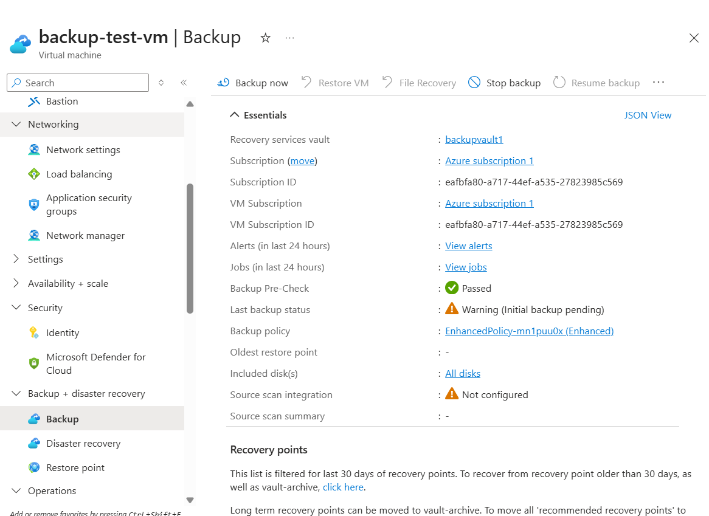
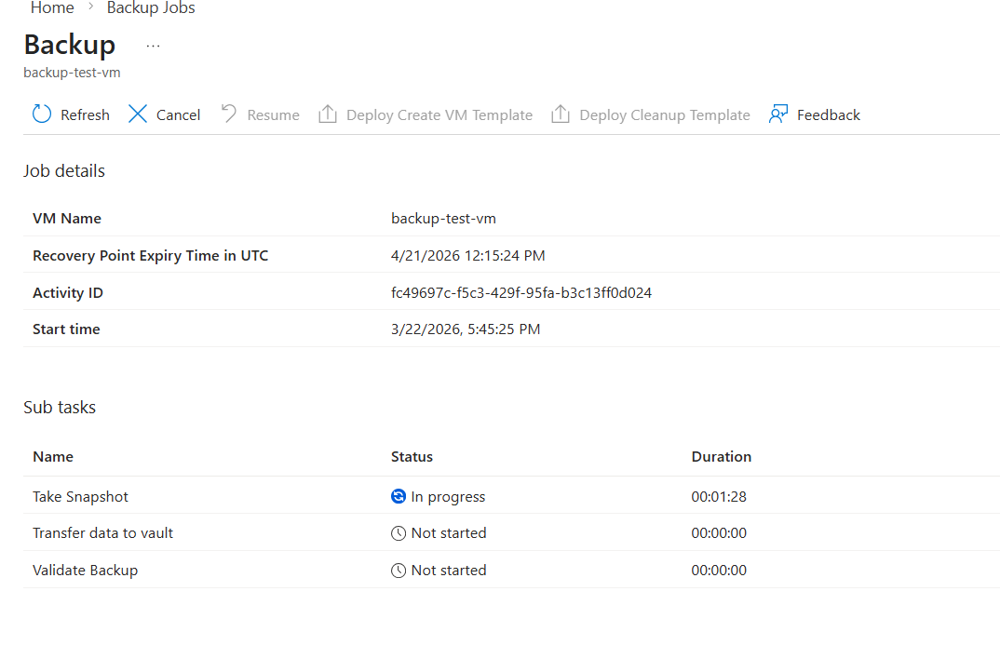
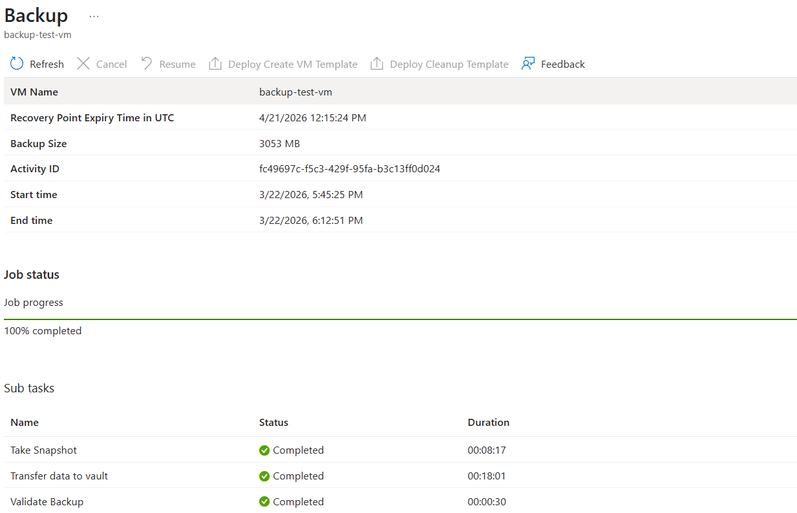
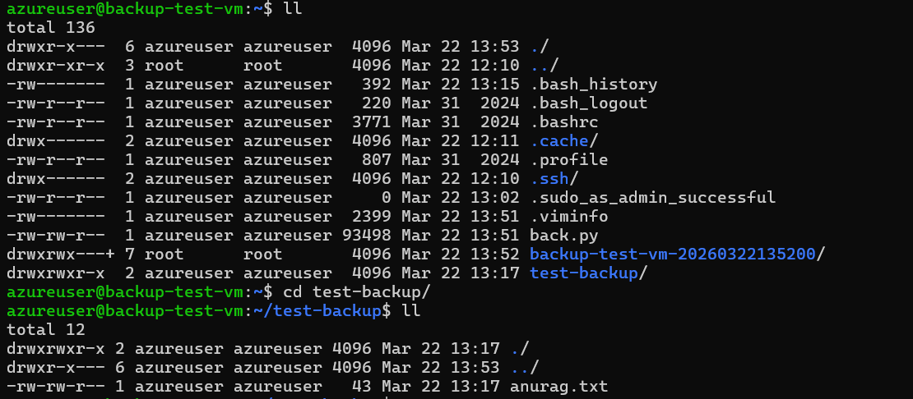
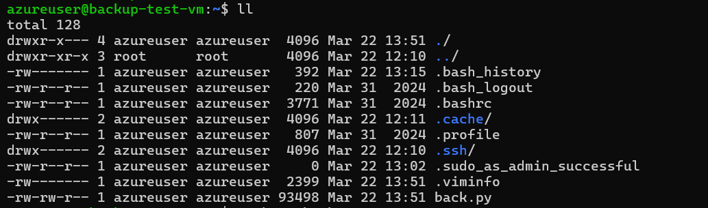

# Azure VM Backup Project

## 📌 Project Overview
This project demonstrates how to configure automated backup for an Azure Virtual Machine using **Azure Backup** and **Recovery Services Vault**.

The goal of this project is to protect virtual machines from data loss by implementing a scheduled backup policy.

---

## 🛠 Services Used

- Azure Virtual Machine
- Azure Backup
- Recovery Services Vault
- Backup Policy

---

## 🏗 Architecture

User
   │
Azure Virtual Machine
   │
Azure Backup
   │
Recovery Services Vault

---

## ⚙️ Steps Performed

1. Created a Resource Group
2. Deployed an Azure Virtual Machine
3. Created a Recovery Services Vault
4. Enabled backup for the VM
5. Applied default backup policy
6. Triggered manual backup job

---

## 📊 Result

Backup was successfully configured for the Azure Virtual Machine.

- Backup policy applied
- Backup job executed
- VM protected in Recovery Services Vault

---
## Project Screenshots

### VM Overview

### Recovery Services Vault Overview

### Vault Deployment

### Backup Pre-checks

### Backup Progress

### Backup Status

### File Uploaded to VM

### Deleted File Before Restore

## 🎯 Learning Outcome

- Learned how Azure Backup works
- Configured Recovery Services Vault
- Protected Azure VM using backup policies
- Triggered and monitored backup jobs
