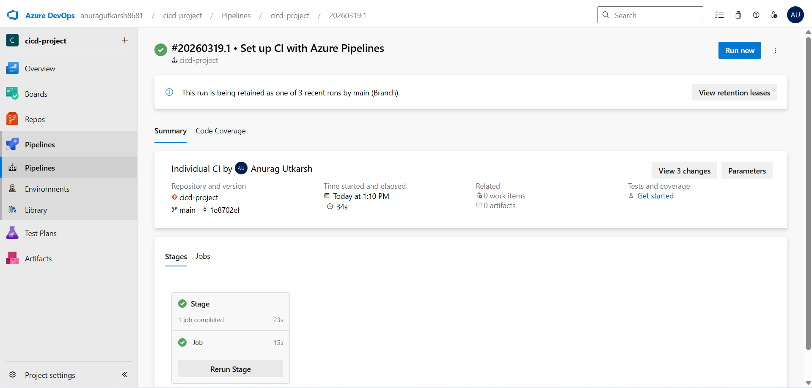
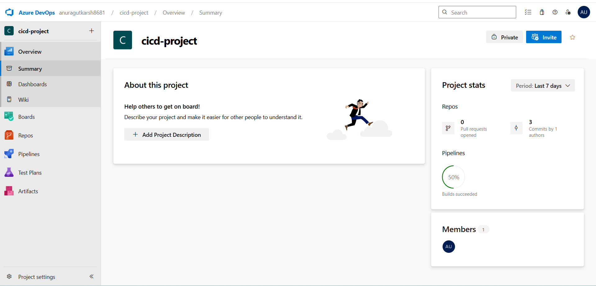
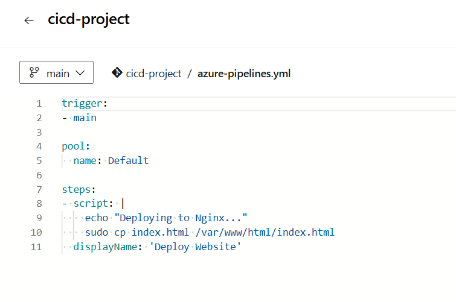
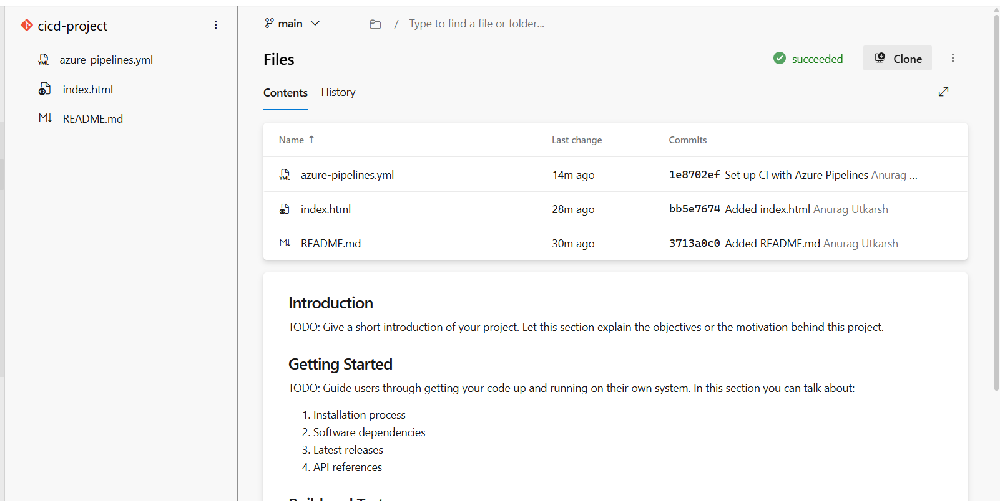
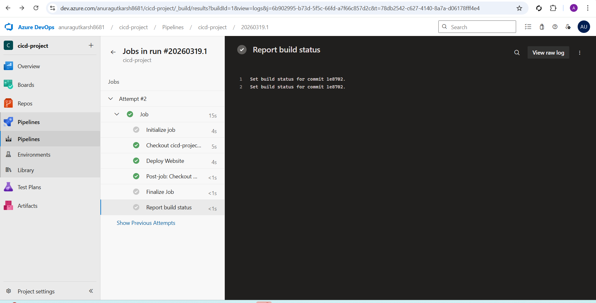
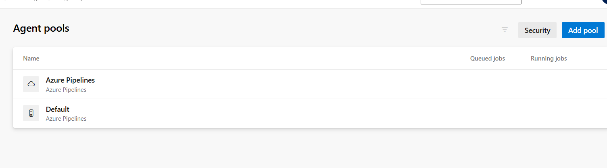
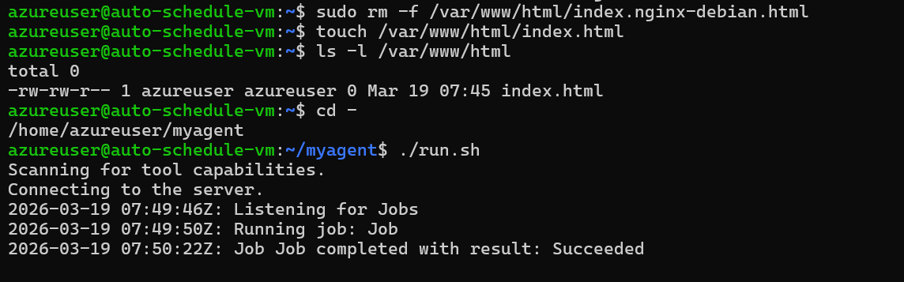
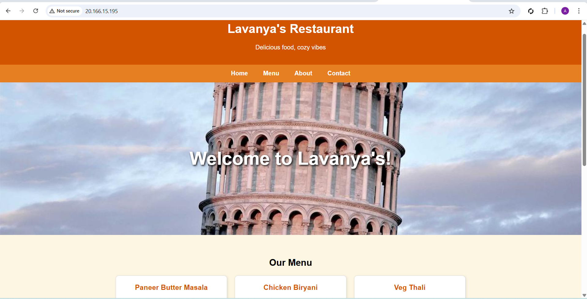

# 🚀 Azure CI/CD Pipeline with Self-Hosted Agent

## 📌 Project Overview

This project demonstrates how to set up a CI/CD pipeline using Azure DevOps to automatically deploy a web application to an Azure Virtual Machine running Nginx.

---

## 🧱 Architecture

* Azure DevOps (CI/CD Pipelines)
* Azure Virtual Machine (Ubuntu)
* Nginx Web Server
* Self-Hosted Agent

---

## ⚙️ Step-by-Step Implementation

### 1️⃣ Create Azure DevOps Project

* Login to Azure DevOps
* Create a new project

---

### 2️⃣ Create Repository

* Go to Repos
* Initialize repo with README
* Add `index.html`

---

### 3️⃣ Create Azure VM

* Create Ubuntu VM
* Allow ports: 22 (SSH), 80 (HTTP)

---

### 4️⃣ Install Nginx

```bash
sudo apt update
sudo apt install nginx -y
```

---

### 5️⃣ Setup Self-Hosted Agent

```bash
mkdir myagent && cd myagent
wget <linux-agent-link>
tar zxvf *.tar.gz
./config.sh
./run.sh
```

---

### 6️⃣ Create Pipeline (YAML)

```yaml
trigger:
- main

pool:
  name: Default

steps:
- script: |
    echo "Deploying..."
    cp index.html /var/www/html/index.html
  displayName: 'Deploy Website'
```

---

### 7️⃣ Fix Permissions

```bash
sudo chown -R azureuser:azureuser /var/www/html
```

---

### 8️⃣ Test CI/CD

* Modify index.html
* Commit changes
* Pipeline auto triggers

---

## 🌐 Output

Website successfully deployed on Azure VM via CI/CD pipeline.

---

## 📸 Screenshots


















---

## 🎯 Key Learnings

* Azure DevOps Pipelines
* Self-hosted agent setup
* Automated deployment
* Real-time CI/CD

---

## 🔥 Author

Anurag Utkarsh
