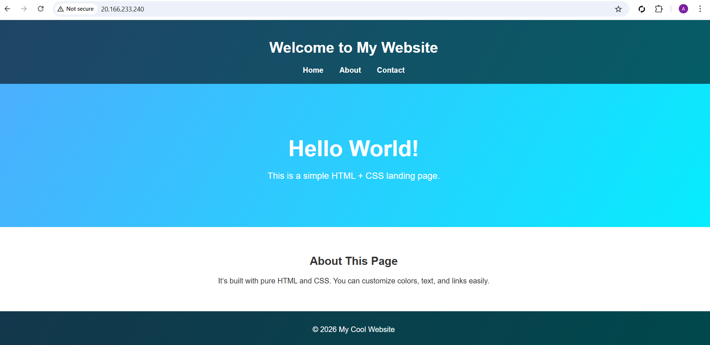
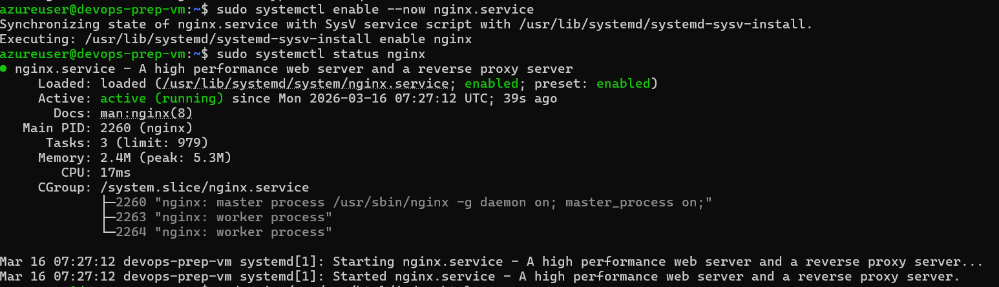

# Project 1 – Azure VM NGINX Web Server

## Architecture

Internet
   |
Public IP
   |
Azure Virtual Machine (Ubuntu)
   |
NGINX Web Server

## Services Used

- Azure Virtual Machine
- Public IP Address
- Network Security Group
- Ubuntu Server
- NGINX

## Architecture

## Output

## Commands Used

ssh azureuser@20.166.233.240
sudo apt update
sudo apt install nginx -y
sudo systemctl start nginx
sudo systemctl enable nginx

## Result
Successfully deployed a public web server on Microsoft Azure Cloud.

