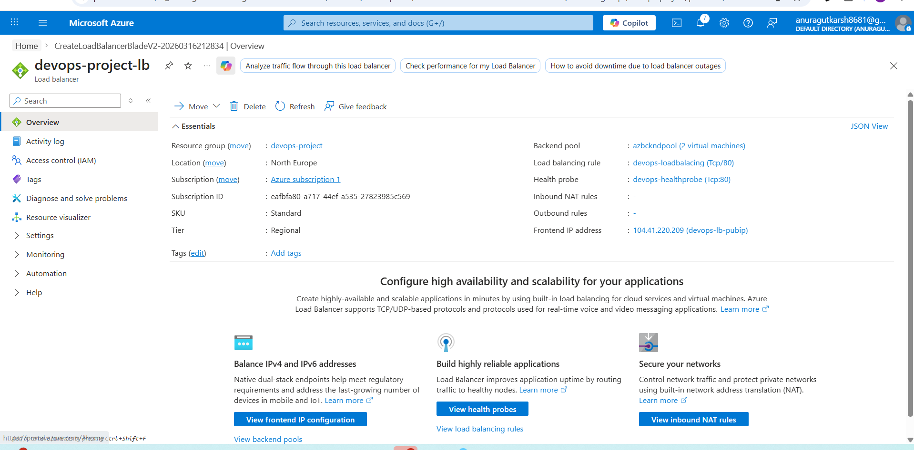
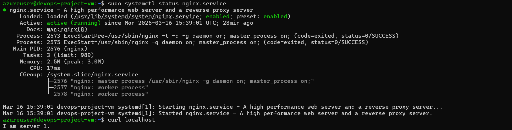
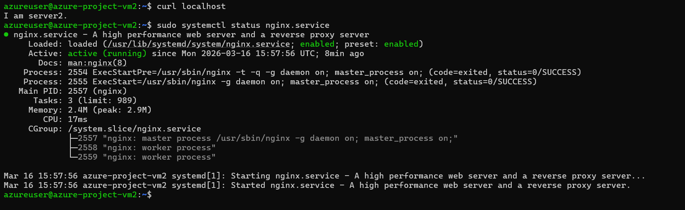

## Architecture

Internet → Public IP → Azure Load Balancer → Backend Pool → Ubuntu VMs → NGINX

## Services Used

- Azure Virtual Machine
- Azure Load Balancer
- Public IP Address
- Network Security Group
- Ubuntu Server
- NGINX Web Server

## Infrastructure Setup

1. Created two Ubuntu Virtual Machines
2. Installed NGINX on both servers
3. Created Azure Load Balancer
4. Configured Frontend Public IP
5. Added both VMs to Backend Pool
6. Configured Health Probe (HTTP port 80)
7. Created Load Balancing Rule

## Commands Used

SSH into VM
sudo apt update
sudo apt install nginx -y
sudo systemctl start nginx
sudo systemctl enable nginx
sudo nano /var/www/html/index.html
VM1
SERVER 1
VM2
SERVER 2

## Result
Traffic is distributed between two backend servers using Azure Load Balancer.
Example:
SERVER 1
SERVER 2
SERVER 1
SERVER 2
## Learning Outcome

- Azure Load Balancer configuration
- Backend Pool setup
- Health Probe monitoring
- Load balancing traffic distribution

## Architecture Images

