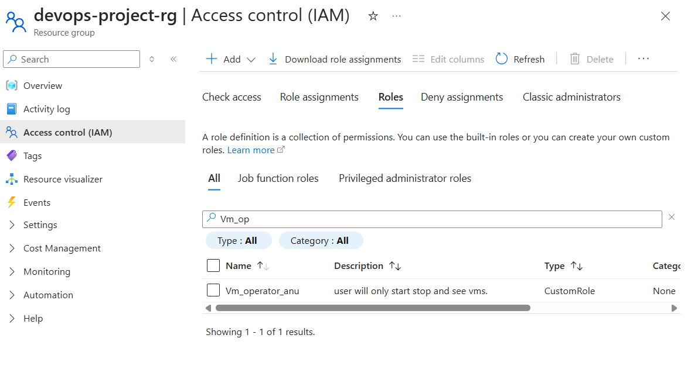
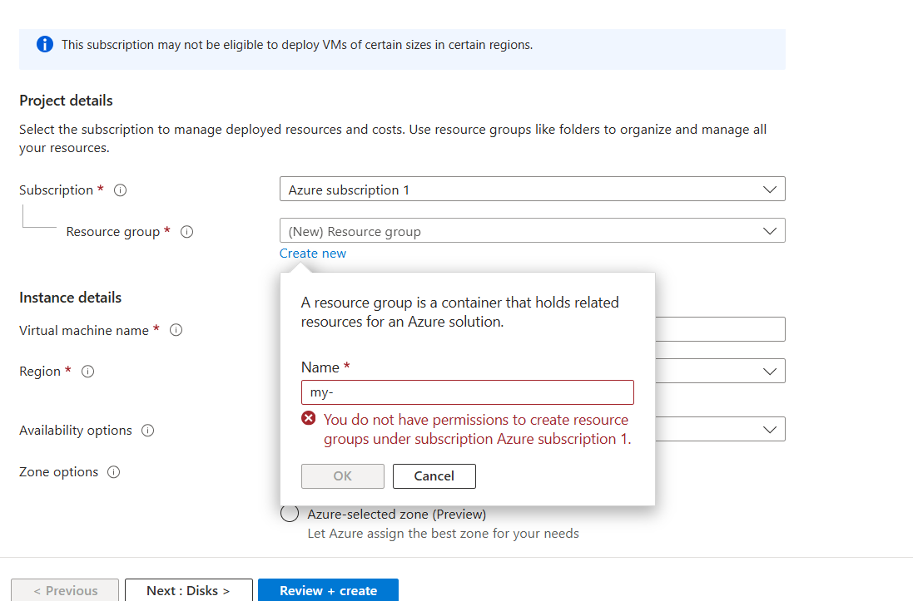
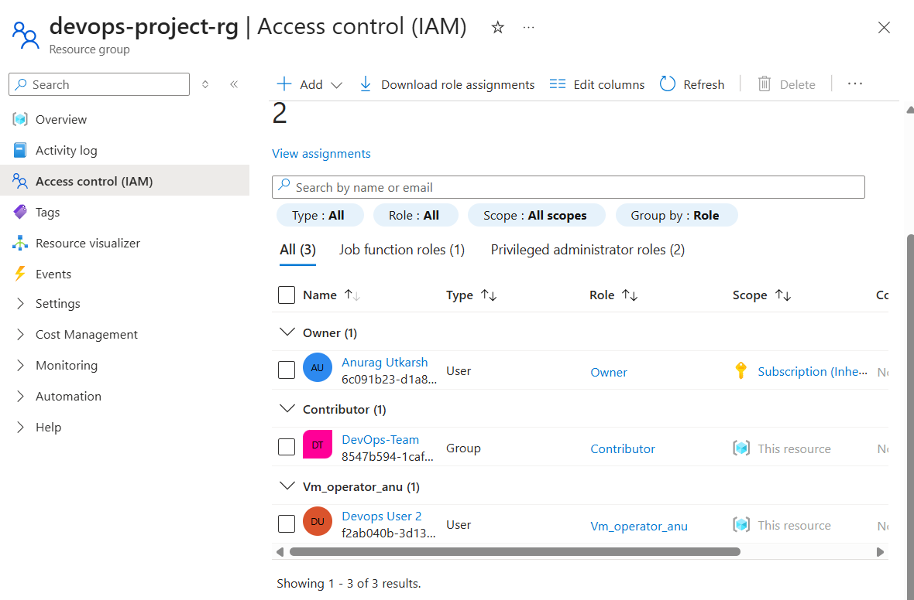

# Project 3 – Azure IAM and Custom RBAC Role

## Overview

This project demonstrates how Role Based Access Control (RBAC) works in Azure using a custom role.

Instead of assigning built-in roles like Contributor, a custom role was created to follow the principle of least privilege.

## Architecture

User → Security Group → Custom RBAC Role → Resource Group → Azure Resources

## Components

- Microsoft Entra ID User
- Security Group (DevOps-Team)
- Custom RBAC Role
- Resource Group Scope
- Azure IAM

## Implementation Steps

1. Created a user in Microsoft Entra ID.
2. Created a security group named **DevOps-Team**.
3. Added the user to the group.
4. Created a **Custom RBAC Role** with read permissions.
5. Assigned the custom role to the group at the Resource Group scope.
6. Verified access using the DevOps user login.

## Custom Role Permissions

Example permissions used:
Microsoft.Resources/subscriptions/resourceGroups/read
Microsoft.Compute/virtualMachines/read

These permissions allow users to view resources but not modify them.

## Security Concept

This implementation follows the **Least Privilege Principle**, ensuring that users only get the minimum required access.

## Result

The DevOps user was able to view resources inside the resource group but could not create or delete resources.

