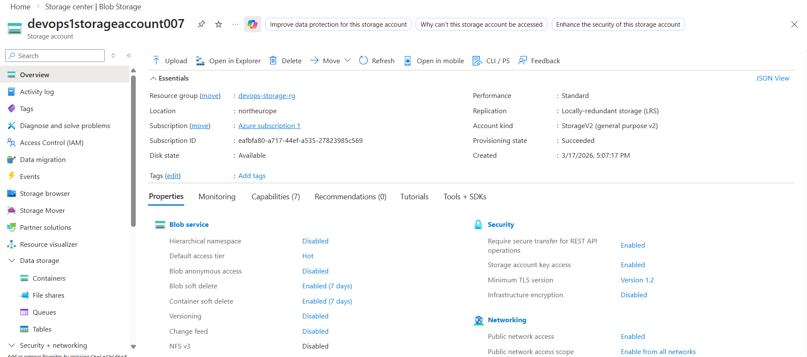
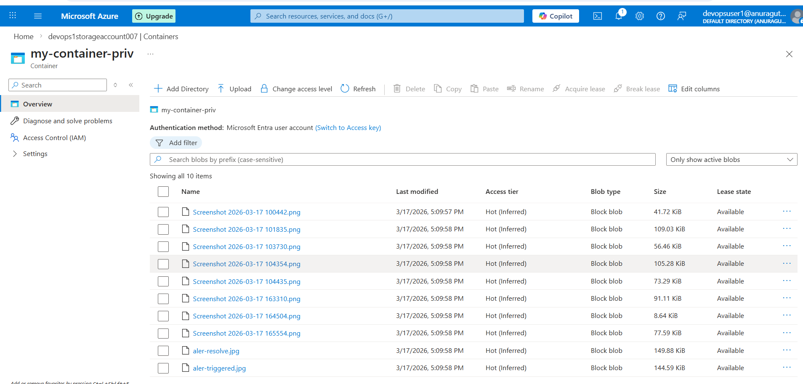
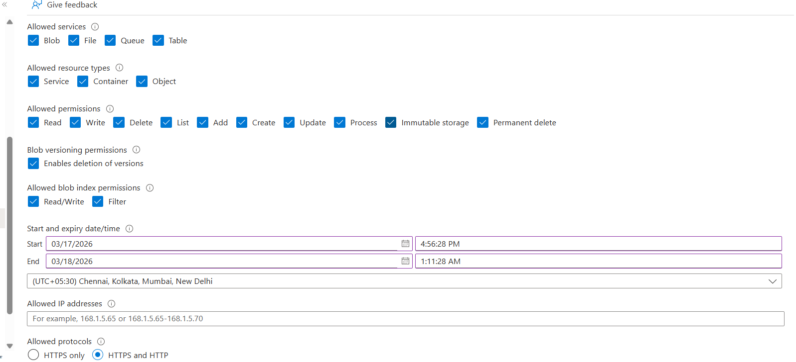
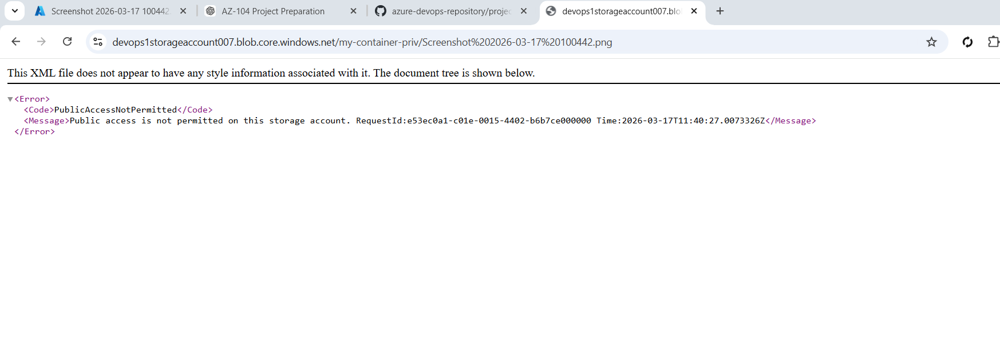
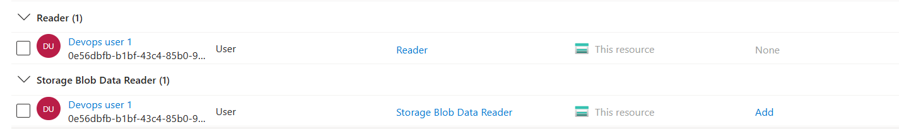

# 📦 Project 5 – Azure Storage + RBAC + SAS

## 🎯 Objective

Implement secure access to Azure Storage using RBAC and SAS tokens.

---

## 🧱 Architecture

Internet → Azure Storage Account → Blob Container → Secure Access (RBAC / SAS)

---

## ⚙️ Services Used

* Azure Storage Account
* Blob Container
* RBAC (IAM)
* Shared Access Signature (SAS)

---

## 🪜 Steps Performed

### 1️⃣ Storage Account Creation

* Created storage account in North Europe
* Standard performance with LRS redundancy

### 2️⃣ Blob Container Setup

* Created private container `devops-container`
* Uploaded sample file

### 3️⃣ Access Restriction Test

* Tried accessing blob URL directly → ❌ Access Denied

### 4️⃣ SAS Token Configuration

* Generated SAS token with:

  * Read
  * List permissions
* Accessed file via SAS URL → ✅ Success

### 5️⃣ RBAC Implementation

* Created user: `devopsuser1`
* Assigned roles:

  * Reader
  * Storage Blob Data Reader

### 6️⃣ RBAC Access Validation

* Logged in using new user
* Accessed container and read files successfully

---

## 📸 Screenshots

### 🔹 Storage Account Overview

---

### 🔹 Container Files

---

### 🔹 SAS Permission Configuration

---

### 🔹 SAS Token Generation

---

### 🔹 Access Denied (Without SAS)

---

### 🔹 Custom Role Assigned

---

### 🔹 Overall Architecture / Overview

---

## 🧠 Key Learnings

* Implemented least privilege access using SAS
* Understood difference between RBAC and SAS
* Learned management vs data plane access
* Validated secure storage access methods

---

## 💡 Interview Points

* SAS provides temporary access without login
* RBAC provides role-based access with login
* Both management and data roles are required for full access

---
